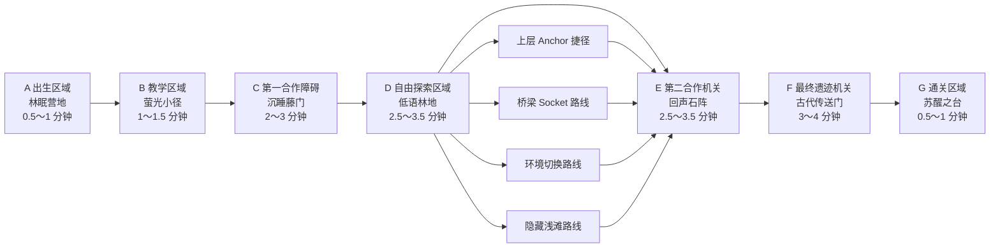

# 《沉睡森林》关卡设计 v1.0

## 0. 文档信息

| 项目 | 内容 |
|---|---|
| 关卡名称 | 《沉睡森林》 |
| LevelId | `level.sleeping_forest` |
| 文档版本 | v1.0 |
| 目标版本 | 第一阶段 P1 完整 MVP |
| 支持人数 | 2～4 人，允许重复选择角色 |
| 目标时长 | 约 15 分钟；可接受范围 10～20 分钟 |
| 地图形态 | 单场景、独立小地图、固定默认布局 |
| 表现形式 | 2.5D 空间表现，Universal 3D/URP |
| 联机模式 | Photon Fusion 2 Host Mode，主机集中权威 |

本文档细化《沉睡森林》的可实现规则。术语以 `Docs/01_Project/Project_Glossary.md` 为准；系统边界以现有 v1.1 总设计、MVP 计划、技术架构和系统设计文档为准。

---

## 1. 关卡目标

### 1.1 玩家目标

玩家进入被魔法沉睡笼罩的森林，找到三件古代传送门部件，解决沿途三个合作机关，修复遗迹中的传送门并全员撤离：

- 穿过“沉睡藤门”，取得 `puzzle.portal_core`。
- 探索“低语林地”，取得 `puzzle.portal_lens`。
- 完成“回声石阵”，取得 `puzzle.portal_stabilizer`。
- 将三件部件安装到“古代传送门”，完成双人协作启动。
- 所有仍在会话中的有效玩家进入通关区域。

### 1.2 MVP验证目标

本关是第一阶段 MVP 的唯一完整关卡，必须验证：

1. 2～4 人是否会自然分工、等待、互助和分享发现。
2. 四种角色能力是否会明显改变路线、成本、信息或操作步骤。
3. 环境机关是否需要观察和合作，而不是只做单人按键。
4. 同一障碍的标准解法、通用替代解法和角色优势解法是否都合理。
5. 全队不开麦时，场景标记、轻量小地图、快捷意图和视觉反馈是否足以通关。
6. 操作失败能否转化为笑点、队友救援或短暂变化，而不是整关重开。

### 1.3 设计底线

- 所有关键机关均有两人基础解。
- 3～4 人只增加并行分工和效率，不增加必须同时操作的槽位。
- 缺少任一角色，甚至全队重复选择同一角色，都不能造成主线硬锁。
- 角色能力提供优势，不作为唯一通关条件。
- 交流行为不会直接充当机关成功条件。
- 普通失败不清空关卡进度，不销毁已安装的关键部件。
- 不包含战斗 Boss、生命值战斗、开放世界、复杂基地或玩家编辑器。

---

## 2. 玩家背景

沉睡森林原本由一座古代传送遗迹维持生机。遗迹停摆后，森林的梦境魔法失控：藤蔓封住道路，石阵不断复述错误的回声，传送门的三个部件散落在林地中。

Wonder Squad 接到一段断续的求救信号，进入森林调查。玩家并非前来消灭敌人，而是要理解环境、重新连接遗迹，并在森林制造的滑稽意外中互相搭救。

叙事只通过短句提示、环境图案、角色反应和机关反馈表达，不使用长对话或过场阻断 15 分钟关卡节奏。

---

## 3. 地图流程图

### 3.1 空间组织

- 地图使用一条清晰主轴串联七个区域，避免玩家在小地图中长时间迷路。
- 自由探索区域形成一次短暂分流，所有路线在回声石阵前汇合。
- 各关键区域通过树冠、岩壁和遗迹门洞控制视线与加载边界，但仍属于同一独立关卡场景。
- 轻量小地图使用固定俯视轮廓，不显示导航路线、战争迷雾或动态生成内容。
- MVP 使用固定默认布局；资源位置、机关组合和任务条件不做实际随机变化。

### 3.2 每个区域预计时间与节奏预算

| 区域 | 目标时间 | 首次游玩上限参考 | 核心节奏 |
|---|---:|---:|---|
| A 林眠营地 | 0.5～1 分钟 | 1.5 分钟 | 集合、理解目标 |
| B 萤光小径 | 1～1.5 分钟 | 2 分钟 | 学习移动、互动、标记 |
| C 沉睡藤门 | 2～3 分钟 | 4 分钟 | 第一次明确双人协作 |
| D 低语林地 | 2.5～3.5 分钟 | 5 分钟 | 分工探索、收集和选路 |
| E 回声石阵 | 2.5～3.5 分钟 | 5 分钟 | 无语音节奏协作 |
| F 古代传送门 | 3～4 分钟 | 5 分钟 | 汇总资源、部件和能力 |
| G 苏醒之台 | 0.5～1 分钟 | 1.5 分钟 | 全员撤离、结算 |
| **合计** | **约 15 分钟** | **目标不超过 20 分钟** | 完整合作闭环 |

关卡计时只用于测试和结算展示，不在 20 分钟时强制失败。

---

## 4. 玩家可执行行为

本关只使用 MVP 已批准行为：

- 移动、跳跃和通过预定义攀爬/落脚点。
- 对交互点进行点击、按住、同步窗口或多人槽位交互。
- 拾取资源；资源自动进入团队共享库存。
- 在制作台选择少量固定配方。
- 携带、放下、安装 Tool 和 PuzzlePart 场景实例。
- 使用当前角色唯一的标志性能力。
- 创建地点、资源、机关、路线、危险和求救标记。
- 使用“来这里、等待、我来、你来、需要帮助、资源不足、完成了”等快捷意图。
- 使用指向、挥手、思考、庆祝、拒绝和求救等角色动作。
- 对受困队友进行按住式救援。

本关不提供攻击、伤害、武器、自由建造、任意绳索、连续物理牵引或地形变形。

---

## 5. 分区域详细设计

## 5.1 A区：出生区域——林眠营地

### 区域目标

- 让 2～4 名玩家完成生成、互相辨认和集合。
- 在 30 秒内看见最终遗迹的远景光柱，理解大方向。
- 给玩家安全试用移动、跳跃、动作轮盘和标记的空间。

### 布局与内容

- 四个出生点围绕熄灭的营火呈半圆排列。
- 中央地图石显示三件缺失部件的图形。
- 远处遗迹发出断续光柱，作为主目标视觉锚点。
- 出口没有机械锁；所有已加载玩家就绪后，藤叶自然打开。

### 角色能力使用点

出生区不要求能力。四个角色的能力图标通过地图石上的四种预定义目标轮廓做一次纯信息展示，不触发共享状态。

### 非语音需求

- 首个 UI 提示引导玩家对遗迹光柱发送“来这里”地点标记。
- 该提示可跳过，标记行为不作为出口开启条件。
- 队友、遗迹目标和有效标记必须同时显示在世界与小地图。

### 完成条件

所有已连接玩家加载完成，至少一名玩家进入萤光小径入口。主机将目标从“集合”切换为“沿萤光小径前进”。

---

## 5.2 B区：教学区域——萤光小径

### 区域目标

以不依赖语音的方式教学移动、互动、资源拾取、共享库存和双人站位。

### 核心流程

1. 玩家跨过两段低矮树根，学习跳跃。
2. 任意玩家拾取木材和石材，所有玩家看到团队库存增加。
3. 两名玩家分别站上叶形踏板。
4. 踏板亮起相同形状图标，前方树桥展开并保持开启。
5. 第一个通过的玩家可使用“完成了”或挥手引导队友。

### 机关规则

- 两块踏板之间保持直视关系。
- 每块踏板上方显示占用者图标。
- 两块踏板都占用满 0.5 秒后树桥锁定为开启，不要求毫秒级同步。
- 3～4 人时仍只需任意两人站位，其他人可收集资源或先通过。
- 踏板失败只熄灭，不施加惩罚。

### 标准解法

两名玩家各站一块踏板，等待 0.5 秒，树桥展开。

### 替代解法

一名玩家先用附近的可推动树桩压住一块预定义踏板 Socket，另一名玩家站上另一块踏板。树桩只沿短轨道移动，不采用自由刚体堆叠。

### 非语音合作

这是第一个不依赖语音的合作机关：

- 空踏板自动显示“需要队友”图标。
- 玩家可直接对空踏板发送“来这里”或“你来”。
- 已占用踏板显示“等待”建议。

### 完成条件

任意玩家越过树桥并激活 `checkpoint.tutorial_exit`。

---

## 5.3 C区：第一合作障碍——沉睡藤门

### 区域目标

让玩家第一次明确选择“收集制作”“多人绕行”或“角色优势”中的一种方案，并取得传送门核心。

### 场景构成

- 主藤门：由两处控制根和一个中央门体组成。
- 左侧制作台：可制作 `tool.vine_cutter`。
- 右侧上层根道：包含两个地面踏根和一个高处释放轮。
- 魔法状态目标：`environment.vine_gate_sleep_state`。
- 观察目标：`reveal.vine_gate_control_roots`。
- 探险家路线：`anchor.vine_gate_lower` → `anchor.vine_gate_upper`。
- 门后奖励座：放置 `puzzle.portal_core`。

### 通用标准解法：制作藤蔓切割器

1. 团队收集并支付 2 木材、1 石材、1 零件。
2. 在制作台生成 `tool.vine_cutter` 场景实例。
3. 玩家甲按住主藤门曲柄，使两处控制根暴露。
4. 玩家乙携带切割器，依次对两处控制根交互。
5. 两处根均切断后，藤门永久打开，切割器进入 `Consumed`。

规则：

- 曲柄松开后，已完成的单个切割节点不会倒退。
- 不要求一个玩家同时处理两处节点。
- 2 人可稳定完成；3～4 人可并行收集和运送资源。

### 通用替代解法：上层释放轮

1. 玩家甲、乙依次踩住地面的两块“生长踏根”，使根道分两段展开。
2. 一名玩家沿根道到达高处释放轮。
3. 地面玩家保持最后一块踏根，等待高处玩家按住释放轮 2 秒。
4. 藤门从内部松开。

该路线不需要任何特定角色，但步骤更长、落点更窄。每段根道展开后保持 5 秒，提供充足的视觉协调时间。

### 角色优势解法

| 角色 | 预定义能力目标 | 优势 |
|---|---|---|
| 探险家 | `anchor.vine_gate_lower/upper` | 建立直达高处释放轮的快捷路线，减少踏根步骤 |
| 工匠 | `socket.vine_cutter_recipe` | 对切割器配方应用一次成本修饰，少消耗 1 木材 |
| 魔法师 | `environment.vine_gate_sleep_state` | 将藤蔓切换到“深眠”状态；队友按住曲柄 2 秒即可开门 |
| 观察者 | `reveal.vine_gate_control_roots` | 为全队揭示控制根、资源缺口和上层释放轮路线 |

所有能力结果都只作用于预定义 Anchor、Socket、EnvironmentState 或 RevealTarget。

### 欢乐失败事件一：藤蔓弹床

如果玩家在上层根道收回时仍站在弹性末端：

- 主机确认 `failure.vine_catapult`。
- 玩家被抛入门侧安全苔藓窝，不受到伤害。
- 玩家获得最多 6 秒的 `status.vine_tangled`，只能缓慢扭动和求救。
- 队友按住救援 2 秒可提前割开藤条；没有对应角色也可救援。
- 苔藓窝包含 1 个额外木材，失败有轻微发现价值但不构成最快主线。

### 恢复规则

- 切割器掉出地图时返回 `recovery.tool.vine_cutter`。
- 传送门核心离图时返回 `recovery.part.portal_core`。
- 藤门非法状态只局部重置未完成交互，已解决结果不回退。
- 全队受困时由 Level Recovery Orchestrator 恢复到 `checkpoint.vine_gate_entry`。

### 完成条件

藤门状态为 `Solved`，且任意玩家从门后奖励座取下 `puzzle.portal_core`。随后激活 `checkpoint.vine_gate_exit`。

---

## 5.4 D区：自由探索区域——低语林地

### 区域目标

- 让玩家短暂分工寻找资源和 `puzzle.portal_lens`。
- 让四种能力对路线选择产生明显影响。
- 在不做开放世界的前提下提供一次可控的多路线探索。

### 空间结构

低语林地是一个能在约 90 秒内横穿的小型环形区域，包含四条相互可见的路线：

1. **中央溪桥路线：** 收集资源，制作并安装 `tool.bridge_kit`。
2. **树冠 Anchor 路线：** 探险家的快速路线。
3. **发光根桥路线：** 魔法师切换有限环境状态后开启。
4. **隐藏浅滩路线：** 观察者可直接揭示；无观察者时可沿岸边发光蘑菇和水纹找到。

所有路线汇合到镜池小岛，`puzzle.portal_lens` 位于岛上。

### 通用标准解法：桥梁套件

1. 团队支付 3 木材、2 石材、1 零件制作 `tool.bridge_kit`。
2. 主机在制作点生成套件场景实例。
3. 一名玩家把套件搬到 `socket.creek_bridge`。
4. 另一名玩家按住桥基曲柄 2 秒，套件安装完成。
5. 预制桥体展开并永久保持。

工匠可在 `socket.bridge_kit_recipe` 将配方减少 1 木材。

### 通用替代解法：隐藏浅滩

- 任意玩家都能通过环境线索找到浅滩。
- 浅滩由三块固定落脚石构成，不使用动态水流物理。
- 两名玩家需要轮流按住岸边和岛侧的浮根，使中间落脚石保持 5 秒。
- 路线比桥梁更慢，但不消耗资源。

### 角色优势路线

| 角色 | 能力点 | 结果 |
|---|---|---|
| 探险家 | `anchor.whispering_grove_bank/canopy/island` | 建立两段树冠快捷路线，队友也可使用 |
| 工匠 | `socket.bridge_kit_recipe` | 降低桥梁套件成本；仍只生成预定义桥 |
| 魔法师 | `environment.glowing_root_bridge` | 将根桥从“沉睡”切换到“生长”，开启 8 秒通过窗口 |
| 观察者 | `reveal.hidden_shallows` | 将浅滩落脚点和镜片位置共享给全队 |

### 探索约束

- 主线镜片位置固定，不采用随机候选点。
- 玩家不会在该区域获得新能力或永久成长。
- 区域内无敌人和战斗。
- 所有死角都能在 20 秒内返回主环路。
- 已取得镜片后，小地图主目标自动切换为回声石阵。

### 恢复规则

- 桥梁套件未消耗且离图时返回 `recovery.tool.bridge_kit`。
- 镜片离图时返回 `recovery.part.portal_lens`。
- 掉入深水只播放短暂“蘑菇喷泉”表现，并由主机移到最近岸边安全点；不重载场景。

### 完成条件

团队取得 `puzzle.portal_lens`，并至少一名玩家进入回声石阵前庭。

---

## 5.5 E区：第二合作机关——回声石阵

### 区域目标

验证全队不开麦时，玩家能否依靠图形、灯光、倒计时、标记和快捷意图完成节奏协作。

### 场景构成

- 左、右两块共鸣踏板。
- 三组带“形状 + 纹理 + 颜色”的回声石。
- 中央序列显示柱。
- 资源稳定 Socket：`socket.echo_stabilizer`。
- 魔法状态目标：`environment.echo_alignment`。
- 观察目标：`reveal.echo_sequence_preview`。
- 探险家路线：`anchor.echo_ground/upper_resonator`。
- 奖励座：`puzzle.portal_stabilizer`。

重要信息不得只依赖颜色或声音。

### 通用标准解法：三拍共鸣

1. 两名玩家分别站上左、右踏板。
2. 中央显示柱依次展示三组“左/右 + 形状”指令。
3. 对应玩家在自己的符号亮起后，按下相邻回声石。
4. 每拍有效窗口为 1.5 秒；成功后该拍永久记录。
5. 三拍完成后，两人继续站位 1 秒，石阵锁定为 `Solved`。

规则：

- 序列在尝试开始前完整预演一次。
- 下一拍开始前有 1 秒准备提示。
- 使用 Fusion 网络时间判定，不依赖客户端本地倒计时。
- 错误输入只重置当前拍，不清除此前已完成拍。
- 3～4 人仍只需两名操作者；其他人可观察、标记下一目标或收集周边资源。

### 通用替代解法：资源稳定

1. 团队向 `socket.echo_stabilizer` 支付 2 水晶和 1 零件。
2. 石阵将三拍序列简化为一次 3 秒双人同时按住。
3. 两名玩家分别按住左右回声石，进度环满后完成。

该解法不要求工匠或魔法师，是资源成本更高、时序更简单的通用路线。

### 角色优势解法

| 角色 | 能力点 | 优势 |
|---|---|---|
| 探险家 | `anchor.echo_ground/upper_resonator` | 快速到达上层共鸣器并锁定一拍，使标准序列减少为两拍 |
| 工匠 | `socket.echo_stabilizer` | 修复磨损 Socket，使替代解法只消耗 1 水晶和 1 零件 |
| 魔法师 | `environment.echo_alignment` | 将石阵切到“同相”，把每拍窗口延长到 2.5 秒 |
| 观察者 | `reveal.echo_sequence_preview` | 提前向全队显示完整序列，并在目标石上显示共享编号 |

### 非语音合作

这是第二个明确不依赖语音的合作机关：

- 玩家可对左右踏板发送“你来”或“我来”。
- “等待”意图在下一拍前显示在操作者头顶和踏板上。
- 世界标记可锁定下一块目标石；小地图只显示石阵位置，不表现每拍细节。
- 符号、纹理、方向箭头和进度环同时反馈，不以声音作为唯一信息。

### 欢乐失败事件二：回声踉跄

连续两次输入错误时：

- 主机施加 4 秒 `status.echo_wobble`。
- 角色以夸张摇摆动画滑到踏板旁的安全软垫。
- 玩家仍可移动和发送意图，但短时间不能再次操作回声石。
- 状态自动解除，不要求特定角色救援。
- 当前拍重置，已完成拍保留。

### 恢复规则

- 网络迟到输入携带旧 Revision 时直接忽略。
- 若操作者离开踏板，当前拍暂停而不是立即失败。
- 两名操作者都离开 8 秒后，当前拍局部重置。
- 传送门稳定器离图时返回 `recovery.part.portal_stabilizer`。
- 全队无法行动时恢复到 `checkpoint.echo_entry`。

### 完成条件

回声石阵为 `Solved`，玩家取得 `puzzle.portal_stabilizer`，并激活 `checkpoint.echo_exit`。

---

## 5.6 F区：最终遗迹机关——古代传送门

### 区域目标

汇总本关的部件搬运、资源决策、角色能力、非语音分工和欢乐失败，形成两人即可完成的最终合作高潮。

### 场景构成

- 三个部件 Socket：
  - `socket.portal.core`
  - `socket.portal.lens`
  - `socket.portal.stabilizer`
- 左、右能量臂。
- 中央启动台。
- 紧急锁定 Socket：`socket.portal.emergency_lock`。
- 探险家上层维护 Anchor。
- 魔法师能量状态目标。
- 观察者符文映射 RevealTarget。
- 传送门出口和安全落点。

### 前置条件

三件关键部件必须存在且可恢复：

- `puzzle.portal_core`
- `puzzle.portal_lens`
- `puzzle.portal_stabilizer`

任一部件未安装时，对应 Socket 显示缺失部件图形和其最后已知/恢复位置。关键部件不会进入团队库存。

### 通用标准解法：双臂锁定

1. 玩家将三件部件搬运并安装到对应 Socket。
2. 玩家甲、乙分别走到左、右能量臂。
3. 门环依次显示两侧相同的形状倒计时。
4. 两人各按住能量臂 2 秒；两侧在 2.5 秒容错窗口内完成后锁定。
5. 锁定保持 6 秒，任意一名玩家跑到中央启动台按下启动。
6. 传送门稳定开启，所有玩家可依次进入。

不要求三名玩家同时操作；两人可以完成“锁定两侧，再启动中央”的完整流程。

### 通用替代解法：资源紧急锁

1. 团队向 `socket.portal.emergency_lock` 支付 3 水晶和 2 零件。
2. 紧急锁永久锁定其中一侧能量臂。
3. 玩家甲按住另一侧能量臂，玩家乙操作中央启动台。
4. 保持 3 秒后传送门开启。

该路线消耗更多探索资源，但降低同步步骤，任何角色组合均可使用。

### 角色优势解法

| 角色 | 能力点 | 优势 |
|---|---|---|
| 探险家 | `anchor.portal_floor/maintenance_ring` | 到达上层维护环，提前将双臂锁定保持时间延长到 10 秒 |
| 工匠 | `socket.portal.emergency_lock` | 修复紧急锁，替代解法成本降为 2 水晶和 1 零件 |
| 魔法师 | `environment.portal_energy_phase` | 切换到“稳定相位”，将双臂容错窗口延长到 4 秒 |
| 观察者 | `reveal.portal_rune_mapping` | 向全队显示左右能量臂与部件 Socket 的符号对应和操作顺序 |

### 非语音协作反馈

- 左右能量臂始终使用方向、图形和独立进度环。
- 玩家对能量臂发送“我来”后，该意图显示在对应控制点上。
- 一侧完成时，另一侧显示“等待/还需要队友”的视觉反馈。
- 中央启动台在两侧未锁定时只显示缺失条件，不执行失败动画。
- 所有玩家都能看到部件是否安装、哪一侧已锁定及剩余保持时间。

### 欢乐失败事件三：传送泡泡

如果双臂顺序错误或启动台在能量不稳定时被重复操作：

- 主机确认 `failure.portal_backfire`。
- 最近的操作者被包进 `status.portal_bubble`，沿固定短轨迹漂到安全平台。
- 受困玩家自动发出求救图标，仍可使用快捷意图。
- 队友按住泡泡 2 秒即可戳破；7 秒后也会自动破裂。
- 错误只清除本轮能量锁定，不卸下三件部件，也不消耗额外资源。

### 恢复规则

- 三件关键部件离图时分别回到其 RecoveryPoint。
- 已安装部件在局部重置中保持安装状态。
- 紧急锁已支付的资源和完成状态不回滚。
- 非法机关状态由 Level Recovery Orchestrator 按统一恢复事务处理。
- 全队受困时恢复到 `checkpoint.portal_entry`，并清除当前能量充能，不重置前两个机关。

### 完成条件

古代传送门进入稳定开启状态并发布一次 `PuzzleSolved`。Level 将主目标切换为“全员进入苏醒之台”。

---

## 5.7 G区：通关区域——苏醒之台

### 区域目标

让玩家在短时间内集合、庆祝并完成明确结算，不进入下一张开放地图。

### 规则

- 传送门后是一个小型安全平台，而不是连续世界。
- 有效玩家进入平台后显示个人到达状态。
- 已断线玩家不阻塞完成；仍连接但受困的玩家必须先由恢复流程解除状态。
- 全部有效玩家到达后，主机确认关卡 `Completed`。
- 播放 5～8 秒的森林苏醒表现和角色庆祝动作。
- 结算显示时间、使用的 SolutionPath、能力贡献、救援次数和有效标记次数。
- 结算后返回房间或关卡选择；MVP 不加载下一关。

---

## 6. 资源和道具分布

### 6.1 物品表示规则

- Resource 拾取后进入团队共享库存，并销毁场景掉落实例。
- Tool 和 PuzzlePart 始终是主机生成的场景实例，不进入抽象库存。
- 同一物品实例在同一时刻只采用一种表示。
- 关键 PuzzlePart 必须配置唯一 RecoveryPoint。

### 6.2 固定默认分布

| 区域 | 木材 | 石材 | 水晶 | 零件 | Tool / PuzzlePart |
|---|---:|---:|---:|---:|---|
| A 林眠营地 | 0 | 0 | 0 | 0 | 无 |
| B 萤光小径 | 2 | 1 | 0 | 0 | 无 |
| C 沉睡藤门及侧窝 | 2 | 1 | 0 | 1 | `tool.vine_cutter` 制作输出；`puzzle.portal_core` |
| D 低语林地 | 5 | 4 | 4 | 3 | `tool.bridge_kit` 制作输出；`puzzle.portal_lens` |
| E 回声石阵周边 | 0 | 0 | 3 | 2 | `puzzle.portal_stabilizer` |
| F 古代传送门应急储藏 | 0 | 0 | 1 | 1 | 三个部件安装目标 |
| **合计** | **9** | **6** | **8** | **7** | 固定默认配置 |

### 6.3 MVP配方和直接消耗

| 用途 | 标准成本 | 工匠优势 | 输出/结果 |
|---|---|---|---|
| 藤蔓切割器 | 2 木材 + 1 石材 + 1 零件 | 少 1 木材 | `tool.vine_cutter` |
| 桥梁套件 | 3 木材 + 2 石材 + 1 零件 | 少 1 木材 | `tool.bridge_kit` |
| 回声稳定 | 2 水晶 + 1 零件 | 1 水晶 + 1 零件 | 简化回声石阵 |
| 传送门紧急锁 | 3 水晶 + 2 零件 | 2 水晶 + 1 零件 | 锁定一侧能量臂 |

资源预算允许无工匠队伍连续选择所有高成本通用方案，并保留少量误判余量。MVP 不设置库存容量，不要求重复刷取资源。

---

## 7. 角色能力使用点

### 7.1 能力矩阵

| 区域 | 探险家 `anchor_route` | 工匠 `socket_repair` | 魔法师 `environment_shift` | 观察者 `reveal` |
|---|---|---|---|---|
| B 萤光小径 | 信息预览，无必需能力 | 信息预览 | 信息预览 | 信息预览 |
| C 沉睡藤门 | 直达高处释放轮 | 降低切割器成本 | 藤蔓切到深眠 | 揭示控制根和路线 |
| D 低语林地 | 树冠到镜池捷径 | 降低桥梁成本 | 开启发光根桥 | 揭示浅滩与镜片 |
| E 回声石阵 | 锁定一拍 | 降低稳定成本 | 延长时序窗口 | 揭示完整序列 |
| F 古代传送门 | 延长双臂锁定 | 降低紧急锁成本 | 延长容错窗口 | 揭示符文对应 |

### 7.2 能力设计约束

- 每个目标都由稳定 ID 和能力标签匹配，不引用具体角色实现类。
- 重复角色不能在同一 EnvironmentState 或 RevealTarget 上叠加同一效果。
- 重复角色可并行作用于不同目标。
- Anchor 只连接作者预定义的端点。
- Socket 只接受配置允许的修复或成本修饰。
- EnvironmentState 只在有限状态之间切换。
- RevealTarget 只揭示预先制作的线索、路线或目标。
- 能力缺失时，标准或通用替代路径仍然成立。

### 7.3 无角色硬锁检查

每个主线节点必须满足：

| 节点 | 不依赖角色的主线通路 |
|---|---|
| 萤光小径 | 双踏板或固定树桩压板 |
| 沉睡藤门 | 制作切割器或双人上层释放轮 |
| 低语林地 | 制作桥梁套件或双人隐藏浅滩 |
| 回声石阵 | 三拍共鸣或资源稳定 |
| 古代传送门 | 双臂锁定或资源紧急锁 |

完整 MVP 发布前，四角色允许重复选择的 65 个无序 2～4 人组合必须通过声明通路和资源预算结构校验；真人游玩覆盖全同角色、缺少各能力方向和双人最不利组合。

---

## 8. 机关规则总表

| 机关 | 最少人数 | 标准解法 | 通用替代解法 | 主要角色优势 | 失败保留 |
|---|---:|---|---|---|---|
| 萤光小径踏板 | 2 | 两人双踏板 | 树桩压住一侧 | 无必需能力 | 树桥已开启状态 |
| 沉睡藤门 | 2 | 切割器 + 曲柄 | 双人上层释放轮 | 四角色均有优势点 | 已切节点、已开门状态 |
| 低语林地过溪 | 2 | 桥梁套件 + 曲柄 | 双人隐藏浅滩 | 路线或成本变化 | 已安装桥、已取得镜片 |
| 回声石阵 | 2 | 三拍共鸣 | 资源稳定长按 | 步数、成本、窗口或信息变化 | 已完成拍、已解机关 |
| 古代传送门 | 2 | 双臂锁定后启动 | 资源紧急锁 | 保持、成本、窗口或信息变化 | 已安装部件、已支付紧急锁 |

所有同步窗口均使用网络时间；机关状态只有主机可以转换。客户端只提交交互、能力、物品放置和制作意图。

---

## 9. 标准解法与替代解法规则

### 9.1 选择原则

- 玩家不需要在进入关卡前预选一条路线。
- 环境反馈必须让团队在 20 秒内理解至少一个可尝试方向。
- 角色优势路线更快、更省资源或更清晰，但不能让其他路线显得是惩罚性劳动。
- 通用资源路线使用固定资源预算，不要求资源再生或刷取。
- 通用协作路线最多要求两人同时参与，窗口不得小于 1.5 秒。
- 已经投入的关键进度尽量保留，避免因一次错误重复完整流程。

### 9.2 解法记录

主机为每个机关记录最终 `SolutionPathId`：

- `solution.vine_gate.cutter`
- `solution.vine_gate.upper_release`
- `solution.vine_gate.role_advantage`
- `solution.grove.bridge_kit`
- `solution.grove.hidden_shallows`
- `solution.grove.role_advantage`
- `solution.echo.three_beat`
- `solution.echo.resource_stabilize`
- `solution.echo.role_advantage`
- `solution.portal.dual_arm`
- `solution.portal.emergency_lock`
- `solution.portal.role_advantage`

若多种方式共同完成，以触发最终完成条件的路径为主，同时记录使用过的能力和资源辅助标签。该记录只用于测试摘要和结算，不用于排行榜或奖励经济。

---

## 10. 失败与恢复

### 10.1 欢乐失败清单

| 事件 | 触发 | 表现 | 通用恢复 | 进度影响 |
|---|---|---|---|---|
| 藤蔓弹床 | 根道收回时站在末端 | 弹入苔藓窝并被藤条缠住 | 队友救援 2 秒或 6 秒超时 | 不清除藤门节点 |
| 回声踉跄 | 连续两次输入错误 | 夸张摇摆并滑到软垫 | 4 秒自动解除 | 只重置当前拍 |
| 传送泡泡 | 不稳定时错误启动 | 泡泡沿固定轨迹漂到安全台 | 队友救援 2 秒或 7 秒超时 | 不卸部件，只清本轮充能 |
| 蘑菇喷泉 | 掉入深水 | 蘑菇把玩家喷回岸边 | 主机移动到安全点 | 不损失资源或部件 |

前三项为 MVP 必做的三种独立欢乐失败事件；蘑菇喷泉可复用现有状态和位移能力实现。

### 10.2 通用规则

- 失败结果、状态施加、救援成功和恢复位置由主机确认。
- 状态短时、互斥或替换，不在 MVP 做复杂叠层。
- 受困玩家始终能使用求救表达。
- 所有可救援状态都有超时兜底。
- 普通失败不触发整关重载。
- 只有严重系统错误、全队主动重开或无法恢复的会话错误才结束本局。
- 普通 Resource 不因失败掉落；Tool 和 PuzzlePart 按各自恢复规则处理。

### 10.3 检查点

| CheckpointId | 位置 | 激活时机 |
|---|---|---|
| `checkpoint.spawn` | 林眠营地 | 关卡开始 |
| `checkpoint.tutorial_exit` | 萤光小径出口 | 教学树桥通过 |
| `checkpoint.vine_gate_entry` | 藤门前 | 首次到达 |
| `checkpoint.vine_gate_exit` | 藤门后 | 取得核心 |
| `checkpoint.echo_entry` | 石阵前庭 | 首次到达 |
| `checkpoint.echo_exit` | 石阵后 | 取得稳定器 |
| `checkpoint.portal_entry` | 遗迹大厅入口 | 首次到达 |

### 10.4 复合恢复顺序

Level Recovery Orchestrator 是唯一的复合恢复编排者。一次 RecoveryTransaction 固定执行：

1. 暂停新的目标交互。
2. 取消持续交互、救援和持有关系。
3. 恢复关键物品。
4. 局部重置机关并增加 Revision。
5. 清除相关临时状态。
6. 将玩家移动到权威检查点。
7. 恢复交互并发布事务完成。

重复请求使用同一 RecoveryTransactionId，不能重复生成部件或重复传送玩家。

---

## 11. 快捷标记需求

### 11.1 本关使用的标记

| 标记类型 | 典型目标 | 世界表现 | 小地图表现 |
|---|---|---|---|
| 地点 | 踏板、集合点、传送门 | 光柱 + 发送者图标 | 定位图标 |
| 资源 | 木材、水晶、零件堆 | 资源轮廓 + 数量类别 | 资源图标 |
| 机关 | 曲柄、回声石、能量臂 | 机关图标 + 短脉冲 | 机关图标 |
| 路线 | Anchor、浅滩、树桥 | 方向箭头 | 路线端点 |
| 危险 | 收回根道、深水、泡泡区 | 警告图形 | 危险图标 |
| 求救 | 受困玩家 | 持续求救图标 | 高优先级玩家图标 |

### 11.2 快捷意图使用点

- “来这里”：邀请队友到踏板、曲柄、Socket 或能量臂。
- “等待”：提示正在保持踏板、环境窗口或能量锁。
- “我来”：认领回声石、搬运部件或一侧能量臂。
- “你来”：把另一操作位明确交给队友。
- “需要帮助”：请求救援、搬运或同步操作。
- “资源不足”：显示当前目标缺失的资源类别，不传输自由文本。
- “完成了”：通知队友路线、资源或机关步骤已完成。

### 11.3 约束

- 标记由主机校验位置、目标、数量、频率和生命周期。
- 标记同步稳定语义 ID，不同步本地化字符串。
- 求救标记来自权威 StatusSnapshot，不由客户端伪造结果。
- 玩家可在本地隐藏某位玩家的普通标记；求救和主目标仍保留必要提示。
- 重要机关反馈不只依赖标记、声音或颜色。
- 关卡必须通过全队关闭语音的完整游玩测试。

---

## 12. 联机同步对象

### 12.1 主机权威对象和结果

| 类别 | 需要同步的主要内容 |
|---|---|
| 关卡 | LevelId、阶段、目标、计时、Checkpoint、Revision、完成结果 |
| 玩家 | 生成、位置/移动权威结果、当前角色、可行动状态、持有关系 |
| 能力 | AbilityId、目标 ID、请求结果、持续结束时间、环境最终状态 |
| 资源 | 资源节点是否已拾取、团队库存数量和 Revision |
| 制作 | RecipeId、成本修饰、资源原子消耗、Tool 生成结果 |
| Tool | ItemInstanceId、位置、持有者、Socket、状态、恢复 |
| PuzzlePart | ItemInstanceId、位置、持有者、Socket、关键恢复状态 |
| 机关 | PuzzleId、状态、当前拍/槽位、锁定窗口、SolutionPathId、Revision |
| 状态与救援 | StatusId、目标、起止网络时间、救援者、进度、解除结果 |
| 交流 | MarkerSnapshot、QuickIntent 语义事件、求救状态 |
| 通关 | 有效玩家到达状态、完成时间和匿名测试摘要 |

### 12.2 仅本地处理

- 摄像机、屏幕震动、插值和低风险预测表现。
- UI 布局、输入提示、字幕大小和无障碍表现。
- 固定地图轮廓的渲染和世界坐标到小地图坐标的显示转换。
- 音量、设备、普通标记过滤和当前会话静音。
- 不影响玩法的粒子、角色面部和短暂庆祝表现。

### 12.3 同步原则

- 客户端表达意图，主机决定共享结果。
- 短暂 VFX 可用事件；迟加入者必须知道的结果使用快照或持续网络状态。
- 同步窗口全部使用网络时间。
- 每个请求包含 RequestId；机关局部重置增加 Revision。
- MVP 主机退出可结束本局，不要求主机迁移。
- 本关不依赖独立后端或专用服务器。

---

## 13. 通关条件

主机仅在以下条件全部满足时将关卡设为 `Completed`：

1. 沉睡藤门为 `Solved`。
2. 回声石阵为 `Solved`。
3. 古代传送门为 `Solved` 且处于稳定开启状态。
4. 三件 PuzzlePart 均已正确安装。
5. 所有仍在会话中的有效玩家已进入苏醒之台。
6. 当前没有未完成的 RecoveryTransaction。

完成事件只允许发布一次。客户端不能自行宣布通关。

---

## 14. 可测试指标

### 14.1 核心指标

| 指标 | 目标 |
|---|---|
| 完整通关时长中位数 | 13～17 分钟 |
| 10～20 分钟内完成比例 | 内部熟悉规则的有效测试局 ≥ 80% |
| 两人不开麦通关 | 每个代表阵容均能完成 |
| 关键机关无进展停滞 | 单次连续停滞尽量不超过 120 秒 |
| 角色能力可观察贡献 | 四种能力各至少在一项测试中改变路线、成本、信息或窗口 |
| 多解法验证 | 三个主线机关各至少两条 SolutionPath 被实际完成 |
| 欢乐失败恢复 | 中位恢复时间 ≤ 10 秒，95% ≤ 20 秒 |
| 整关意外重置 | 0 次 |
| 关键物品永久丢失 | 0 次 |
| 有意义非语音交流 | 强制无麦测试中，每局出现有效标记、快捷意图或求救闭环 |
| 网络一致性 | 所有客户端机关、库存、部件和状态最终一致 |

### 14.2 测试阵容

至少覆盖：

- 2 人同角色队伍。
- 2 人缺少移动能力方向。
- 2 人缺少制作能力方向。
- 2 人缺少环境能力方向。
- 2 人缺少揭示能力方向。
- 3 人重复角色队伍。
- 4 人四角色齐全队伍。
- 4 人全部同角色队伍。
- 全队不开麦。
- 一名玩家高延迟、短暂掉线或在持有关键部件时离开。

### 14.3 记录字段

- 人数和角色组合。
- 是否全程无麦。
- 各区域进入、完成和停留时间。
- 每个机关最终 SolutionPathId。
- 每种能力成功使用次数。
- 资源获得、消耗和结余。
- Marker 与 QuickIntent 的类型和有效使用次数。
- 各失败事件、状态、救援和恢复耗时。
- 关键部件恢复次数。
- 局部重置和 RecoveryTransaction 次数。

只记录匿名测试摘要，不建设排行榜、账号后端或长期局内存档。

---

## 15. 美术资源清单

### 15.1 环境与地形

- 林眠营地地面、营火、地图石和四人出生垫。
- 萤光小径地表、低矮树根、叶形踏板、预制树桥。
- 沉睡藤门门体、控制根、曲柄、高处根道和苔藓窝。
- 低语林地环形地形、溪流、镜池小岛、浅滩石、树冠平台。
- 回声石阵地面、左右踏板、六块回声石、中央显示柱和软垫。
- 古代遗迹墙体、三部件 Socket、左右能量臂、中央启动台和门环。
- 苏醒之台、关卡边界遮挡和远景森林轮廓。
- 固定俯视小地图背景轮廓。

### 15.2 道具与交互物

- 木材、石材、水晶、零件四类资源节点和拾取表现。
- 藤蔓切割器模型及持有、切割姿态。
- 桥梁套件模型、携带状态和安装后预制桥。
- 传送门核心、镜片、稳定器模型及三个安装状态。
- 制作台、资源稳定 Socket、紧急锁 Socket。
- Anchor、Socket、EnvironmentState 和 RevealTarget 的开发期可视化标识。

### 15.3 角色与状态表现

- 四角色现有基础模型的关卡能力动作。
- 探险家设置/使用 Anchor 路线动作。
- 工匠修复 Socket 和制作动作。
- 魔法师切换环境状态动作。
- 观察者扫描并共享 RevealTarget 动作。
- 藤蔓缠绕、回声踉跄、传送泡泡和蘑菇喷泉表现。
- 通用按住救援动作和获救动作。
- 指向、挥手、等待、求救、思考和庆祝动作。

### 15.4 VFX与UI

- 目标光柱、世界标记、路线箭头和求救图标。
- 角色能力合法目标高亮。
- 机关状态、缺失条件、人数槽位、倒计时和进度环。
- 形状 + 纹理 + 颜色的回声序列符号。
- 传送门能量、开启和森林苏醒特效。
- 团队库存简要反馈、部件收集状态和结算面板。

---

## 16. 音效资源清单

### 16.1 环境与音乐

- 森林日间环境循环：风、树叶、远鸟、微弱遗迹低鸣。
- 林眠营地、低语林地、遗迹大厅的三个轻量环境层。
- 探索、机关进行、最终启动和通关四个音乐层或可切换段落。
- 深水、树冠和石阵的区域性空间音效。

### 16.2 交互和物品

- 脚步、跳跃、落地、攀爬和软垫落地。
- 四类资源拾取。
- 制作开始、完成、资源不足。
- Tool 拾取、放下、安装和恢复。
- 三件 PuzzlePart 拾取、携带、安装和恢复。
- 标记、快捷意图和求救的短促提示音。

### 16.3 机关和能力

- 藤蔓伸展、收回、切割、深眠和藤门开启。
- 树桥/根桥展开、桥梁套件安装。
- 回声石正确拍、错误拍、序列预演和完成和弦。
- 传送门部件安装、能量臂充能、紧急锁和稳定开启。
- 四种角色能力各一组清晰但不遮挡信息的音效。

### 16.4 欢乐失败和恢复

- 藤蔓弹射、缠绕扭动和救援割开。
- 回声踉跄的弹性音和角色滑稽短声。
- 泡泡生成、漂浮、戳破和超时破裂。
- 蘑菇喷泉和安全落地。
- 检查点恢复、局部重置和通关庆祝。

所有关键操作必须有视觉替代，不能仅凭声音判断。

---

## 17. MVP删减建议

如果制作成本超出预算，按以下顺序删减，不能破坏核心验证：

1. 删除不影响主线的装饰性隐藏树洞，只保留苔藓窝失败支线。
2. 减少环境独特模型数量，以材质、灯光和组合方式复用森林模块。
3. 让三种欢乐失败共享一套通用受困、救援和恢复动画骨架，仅保留不同主题 VFX。
4. 将小地图简化为固定拓扑轮廓，保留队友、主目标和标记。
5. 减少角色能力的专属过场，只保留动作、目标反馈和共享结果。
6. 减少非关键环境音层和结算统计动画。
7. 将蘑菇喷泉作为普通越界恢复的表现复用，不做独立复杂状态。

以下内容不能作为常规删减项：

- 2～4 人联机。
- 三个主线机关。
- 四角色各一个标志性能力及至少一次明显价值。
- 每个关键障碍的标准和通用替代解法。
- 全队不开麦可通关。
- 世界与轻量小地图标记、快捷意图和求救。
- 三种欢乐失败事件。
- 主机权威、关键物品恢复和局部重置。

语音 SDK、真实随机关卡变体、玩家关卡编辑器、UGC、商城、排行榜、复杂基地、战斗 Boss 和自由建造本来就不属于本关 MVP，不作为“已制作后删减”的内容。

---

## 18. 验收标准

### 18.1 内容验收

- [ ] 单一独立场景完整包含七个要求区域。
- [ ] 2、3、4 人均可从出生走到结算。
- [ ] 一局目标时长约 15 分钟，大多数有效测试局位于 10～20 分钟。
- [ ] 三个主线机关均有两人基础解。
- [ ] 每个关键障碍均完成过标准解法和至少一种通用替代解法。
- [ ] 不含战斗 Boss、复杂战斗、开放世界、复杂基地或非 MVP 系统。

### 18.2 角色和解法验收

- [ ] 探险家 Anchor 路线在关卡中产生可观察价值。
- [ ] 工匠 Socket 修复/成本修饰产生可观察价值。
- [ ] 魔法师 EnvironmentState 切换产生可观察价值。
- [ ] 观察者 RevealTarget 向全队共享有用信息。
- [ ] 缺少任一角色时仍可通关。
- [ ] 重复角色阵容仍有声明且实际可行的主线路径。
- [ ] 通用替代解法不要求大量重复采集。

### 18.3 非语音和无障碍验收

- [ ] 至少萤光小径与回声石阵可完全依靠视觉、标记和快捷意图协作。
- [ ] 全队不开麦可完成整关。
- [ ] 资源不足、需要帮助、等待、操作分工和完成均可非语音表达。
- [ ] 重要信息不只依赖颜色或声音。
- [ ] 世界标记和轻量小地图标记位置一致、可辨认。

### 18.4 失败和恢复验收

- [ ] 藤蔓弹床、回声踉跄和传送泡泡三种事件可稳定触发和恢复。
- [ ] 至少两种失败提供队友救援或明显的合作恢复机会。
- [ ] 所有受困状态有超时兜底。
- [ ] 普通失败不会重载整张地图。
- [ ] 机关局部重置不清除已保留进度。
- [ ] Tool 和三件关键 PuzzlePart 离图后能到正确 RecoveryPoint。
- [ ] 全队无法互救时 RecoveryTransaction 顺序正确且幂等。

### 18.5 联机和数据验收

- [ ] 主机决定资源、制作、能力、机关、状态、救援、部件和通关结果。
- [ ] 机关同步窗口使用网络时间。
- [ ] 2～4 客户端最终状态一致，旧 Revision 事件不会覆盖新状态。
- [ ] 固定默认布局和资源预算在所有客户端一致。
- [ ] 内容结构校验能发现重复 ID、缺失引用、无通用路径和资源预算为负。
- [ ] 真实物理可行性、时序和时长另经自动流程与人工游玩验证。

---

## 19. 风险与待确认事项

### 19.1 主要风险

| 风险 | 影响 | 当前控制措施 |
|---|---|---|
| 关卡内容超出 15 分钟 | 核心体验被探索或制作拖慢 | 固定小地图、固定资源、每区时间预算 |
| 通用路线显得像惩罚 | 缺角色队伍体验变差 | 限制采集量，替代路线不超过标准路线约 1.5 倍时长 |
| 四能力使机关状态过多 | 实现和测试成本膨胀 | 能力只改有限参数或预定义目标 |
| 2 人承担过多搬运 | 最终段落疲劳 | 关键部件靠近主线汇合点，已安装后不回退 |
| 回声窗口受延迟影响 | 无语音测试失败 | 网络时间、1.5 秒基础窗口、进度逐拍保留 |
| 欢乐失败造成失控过久 | 笑点变成挫败 | 2 秒救援、4～7 秒自动兜底、安全轨迹 |
| 替代资源被提前耗尽 | 后段通用路线无法使用 | 固定预算有余量，消费前显示后续风险提示 |
| 观察者贡献不明显 | 信息能力反馈薄弱 | 揭示结果向全队显示发送者和共享目标 |

### 19.2 待灰盒确认

- 角色基础移动速度和各区域实际尺度。
- 回声石阵 1.5 秒基础窗口在目标网络条件下是否舒适。
- 低语林地四路线是否过密；如过密，保留中央桥和隐藏浅滩作为通用路线，角色路线复用其空间。
- 资源数量的最终余量是否会让成本选择失去意义。
- 关键部件是否允许一名玩家同时持有一个以上；建议 MVP 一人最多携带一个场景物品。
- 玩家中途加入是否开放；若开放，必须获得完整关卡、物品、机关和状态快照。
- 结算后默认保留房间还是返回主菜单。

---

## 20. 关卡对象清单

本清单用于后续 Unity 场景拆分和 Prefab 规划，不代表开始实现代码。

### 20.1 场景根对象与管理对象

| 建议对象名 | 类型 | 数量 | 职责 |
|---|---|---:|---|
| `SleepingForest_LevelRoot` | Scene Root | 1 | 关卡所有内容根节点 |
| `SleepingForest_StaticGeometry` | Scene Root | 1 | 静态地形、遮挡和装饰 |
| `SleepingForest_Gameplay` | Scene Root | 1 | 所有玩法对象 |
| `SleepingForest_Audio` | Scene Root | 1 | 环境音和音乐区域 |
| `SleepingForest_Lighting` | Scene Root | 1 | URP 灯光、体积和探针 |
| `SleepingForest_LevelDefinitionRef` | Scene Object | 1 | 关联关卡数据定义 |
| `SleepingForest_DefaultVariantRef` | Scene Object | 1 | 固定默认布局引用 |
| `SleepingForest_ObjectiveController` | Scene Object | 1 | 目标注册与快照入口 |
| `SleepingForest_RecoveryOrchestratorRef` | Scene Object | 1 | 复合恢复服务注册点 |
| `SleepingForest_LevelBounds` | Volume | 1 | 关卡有效世界边界 |
| `SleepingForest_MiniMapBounds` | Volume | 1 | 固定世界到小地图映射边界 |
| `SleepingForest_OutOfBoundsVolume` | Volume | 若干 | 越界和安全恢复请求 |

### 20.2 区域、出生点和检查点

| 建议对象名 | 类型 | 数量 |
|---|---|---:|
| `Zone_SpawnCamp` | Zone Volume | 1 |
| `Zone_GlowingPath` | Zone Volume | 1 |
| `Zone_SleepingVineGate` | Zone Volume | 1 |
| `Zone_WhisperingGrove` | Zone Volume | 1 |
| `Zone_EchoStoneCircle` | Zone Volume | 1 |
| `Zone_AncientPortalRuins` | Zone Volume | 1 |
| `Zone_AwakeningPlatform` | Zone Volume | 1 |
| `SpawnPoint_Player_01..04` | Spawn Point | 4 |
| `Checkpoint_Spawn` | Checkpoint | 1 |
| `Checkpoint_TutorialExit` | Checkpoint | 1 |
| `Checkpoint_VineGateEntry` | Checkpoint | 1 |
| `Checkpoint_VineGateExit` | Checkpoint | 1 |
| `Checkpoint_EchoEntry` | Checkpoint | 1 |
| `Checkpoint_EchoExit` | Checkpoint | 1 |
| `Checkpoint_PortalEntry` | Checkpoint | 1 |

### 20.3 通用交互与通信 Prefab

| Prefab | 用途 |
|---|---|
| `PF_Interactable_Instant` | 即时交互点 |
| `PF_Interactable_Hold` | 曲柄、释放轮、救援和能量臂 |
| `PF_Interactable_SyncSlot` | 双人踏板和同步窗口 |
| `PF_InteractionPrompt_World` | 本地交互提示 |
| `PF_Marker_World` | 世界标记表现 |
| `PF_Marker_MiniMap` | 小地图标记表现 |
| `PF_QuickIntent_Bubble` | 快捷意图图标与短文本 |
| `PF_HelpMarker_Authoritative` | 权威求救表现 |
| `PF_ObjectiveBeacon` | 主目标光柱 |
| `PF_ConditionDisplay` | 资源、人数、部件和步骤缺失提示 |
| `PF_NetworkProgressRing` | 网络时间进度环 |

### 20.4 资源、制作、Tool与PuzzlePart Prefab

| Prefab | 预计实例/位置 |
|---|---|
| `PF_ResourceNode_Wood` | 9 个固定节点 |
| `PF_ResourceNode_Stone` | 6 个固定节点 |
| `PF_ResourceNode_Crystal` | 8 个固定节点 |
| `PF_ResourceNode_Parts` | 7 个固定节点 |
| `PF_CraftingStation_Forest` | 藤门前、低语林地各 1 |
| `PF_Tool_VineCutter` | 制作生成 |
| `PF_Tool_BridgeKit` | 制作生成 |
| `PF_PuzzlePart_PortalCore` | 藤门奖励座 |
| `PF_PuzzlePart_PortalLens` | 镜池小岛 |
| `PF_PuzzlePart_PortalStabilizer` | 石阵奖励座 |
| `PF_ItemCarryPoint` | Tool/PuzzlePart 通用持有点 |
| `PF_ItemRecoveryPoint` | 每件 Tool/PuzzlePart 对应恢复点 |
| `PF_ItemSocket` | 桥、稳定器、紧急锁和传送门部件 |

### 20.5 萤光小径对象

| 建议对象/Prefab | 数量 |
|---|---:|
| `PF_Tutorial_RootStep` | 2～3 |
| `PF_PressurePlate_Leaf_Left` | 1 |
| `PF_PressurePlate_Leaf_Right` | 1 |
| `PF_PressureWeight_LogOnRail` | 1 |
| `PF_Tutorial_TreeBridge` | 1 |
| `Trigger_TutorialBridgeComplete` | 1 |

### 20.6 沉睡藤门对象

| 建议对象/Prefab | 数量 |
|---|---:|
| `Puzzle_SleepingVineGate_Root` | 1 |
| `PF_VineGate_Main` | 1 |
| `PF_VineControlRoot` | 2 |
| `PF_VineGate_Crank` | 1 |
| `PF_VineGate_GrowthPlate` | 2 |
| `PF_VineGate_TimedRootPath` | 2 段 |
| `PF_VineGate_ReleaseWheel` | 1 |
| `Anchor_VineGate_Lower` | 1 |
| `Anchor_VineGate_Upper` | 1 |
| `Socket_VineCutterRecipeModifier` | 1 |
| `EnvironmentState_VineGateSleep` | 1 |
| `RevealTarget_VineGateControlRoots` | 1 |
| `FailureVolume_VineCatapult` | 1 |
| `SafeLanding_VineMossHollow` | 1 |
| `RewardStand_PortalCore` | 1 |
| `RecoveryPoint_VineCutter` | 1 |
| `RecoveryPoint_PortalCore` | 1 |

### 20.7 低语林地对象

| 建议对象/Prefab | 数量 |
|---|---:|
| `PF_CreekWater_Static` | 1 |
| `PF_CreekBridge_Built` | 1 |
| `Socket_CreekBridge` | 1 |
| `PF_CreekBridge_Crank` | 1 |
| `Anchor_Grove_Bank` | 1 |
| `Anchor_Grove_Canopy` | 1 |
| `Anchor_Grove_Island` | 1 |
| `PF_GlowingRootBridge` | 1 |
| `EnvironmentState_GlowingRootBridge` | 1 |
| `PF_HiddenShallows_SteppingStone` | 3 |
| `PF_ShallowRootHold_Bank` | 1 |
| `PF_ShallowRootHold_Island` | 1 |
| `RevealTarget_HiddenShallows` | 1 |
| `RevealTarget_PortalLens` | 1 |
| `SafePoint_CreekBank` | 2～3 |
| `FailureVolume_DeepWater` | 若干 |
| `RewardStand_PortalLens` | 1 |
| `RecoveryPoint_BridgeKit` | 1 |
| `RecoveryPoint_PortalLens` | 1 |

### 20.8 回声石阵对象

| 建议对象/Prefab | 数量 |
|---|---:|
| `Puzzle_EchoStoneCircle_Root` | 1 |
| `PF_EchoPlate_Left` | 1 |
| `PF_EchoPlate_Right` | 1 |
| `PF_EchoStone` | 6 |
| `PF_EchoSequenceDisplay` | 1 |
| `Socket_EchoStabilizer` | 1 |
| `Anchor_Echo_Ground` | 1 |
| `Anchor_Echo_UpperResonator` | 1 |
| `EnvironmentState_EchoAlignment` | 1 |
| `RevealTarget_EchoSequencePreview` | 1 |
| `SafeLanding_EchoCushion` | 2 |
| `RewardStand_PortalStabilizer` | 1 |
| `RecoveryPoint_PortalStabilizer` | 1 |

### 20.9 古代传送门对象

| 建议对象/Prefab | 数量 |
|---|---:|
| `Puzzle_AncientPortal_Root` | 1 |
| `PF_AncientPortal_Frame` | 1 |
| `Socket_Portal_Core` | 1 |
| `Socket_Portal_Lens` | 1 |
| `Socket_Portal_Stabilizer` | 1 |
| `PF_PortalEnergyArm_Left` | 1 |
| `PF_PortalEnergyArm_Right` | 1 |
| `PF_PortalCentralActivator` | 1 |
| `Socket_PortalEmergencyLock` | 1 |
| `Anchor_Portal_Floor` | 1 |
| `Anchor_Portal_MaintenanceRing` | 1 |
| `EnvironmentState_PortalEnergyPhase` | 1 |
| `RevealTarget_PortalRuneMapping` | 1 |
| `PF_PortalExitVolume` | 1 |
| `PF_PortalBubblePath` | 1 固定轨迹 |
| `SafeLanding_PortalBubble` | 1 |

### 20.10 状态、失败与通关对象

| Prefab / 对象 | 用途 |
|---|---|
| `PF_Status_VineTangled` | 藤条受困表现和救援目标 |
| `PF_Status_EchoWobble` | 踉跄移动修饰和表现 |
| `PF_Status_PortalBubble` | 泡泡受困表现和救援目标 |
| `PF_Failure_MushroomFountain` | 深水越界欢乐恢复 |
| `PF_RescueInteraction` | 通用按住救援 |
| `PF_RecoveryVFX` | 检查点/物品恢复表现 |
| `AwakeningPlatform_ArrivalVolume` | 玩家到达判定 |
| `AwakeningPlatform_PlayerSlot_01..04` | 通关集合位置 |
| `PF_ForestAwakeningSequence` | 5～8 秒通关表现 |
| `PF_LevelResultPanel` | 本地结算展示 |

### 20.11 数据定义资产清单

| 数据资产 | 最小数量/内容 |
|---|---|
| `LevelDefinition_SleepingForest` | 1 |
| `LevelVariant_SleepingForest_Default` | 1，固定默认布局 |
| `PuzzleDefinition_*` | 教学踏板、藤门、回声石阵、传送门 |
| `RoleDefinition_*` | 四个初始角色 |
| `AbilityDefinition_*` | 四个标志性能力 |
| `ItemDefinition_*` | 4 Resource、2 Tool、3 PuzzlePart |
| `RecipeDefinition_*` | 藤蔓切割器、桥梁套件 |
| `StatusDefinition_*` | VineTangled、EchoWobble、PortalBubble |
| `MarkerDefinition_*` | 地点、资源、机关、路线、危险、求救 |
| `QuickIntentDefinition_*` | 来这里、等待、我来、你来、需要帮助、资源不足、完成了 |
| `CheckpointDefinition_*` | 7 个检查点 |
| `RecoveryPointDefinition_*` | 2 个 Tool、3 个 PuzzlePart 及玩家安全点 |
| `ObjectiveDefinition_*` | 集合、教学、三部件、三机关、全员撤离 |

---

## 21. 版本记录

### v1.0

- 首次将 v1.1 总设计中的《沉睡森林》方向细化为七区域、约 15 分钟的完整关卡。
- 冻结三个主线机关的标准、通用替代和角色优势解法。
- 冻结四角色的预定义能力使用点。
- 冻结三种必做欢乐失败及恢复规则。
- 冻结固定默认资源预算、关键部件和 Tool 表示。
- 补充非语音协作、联机同步、测试指标、资产清单和 Unity 对象清单。
